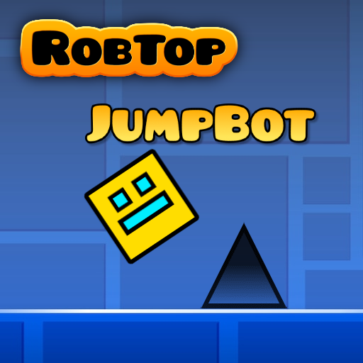

# JumpBot

## Description

JumpBot introduces a unique functionality where, upon pressing CTRL + J and restarting the level, the mod will scan the portal order and then refrain from taking any action. Upon dying in the game, the mod will attempt to retry the level but will jump right before the moment of death. If successful with the next 3 jumps in that position, it will log the outcome to a text file named after the level's name. This information is stored and can be retrieved whenever you return to the level and press CTRL + J, allowing the mod to remember the previous instructions.

## Contributions

Contributions and feedback are welcome. Feel free to fork this repository and submit pull requests with any modifications or improvements.

## License

This project is licensed under the [MIT License](https://opensource.org/licenses/MIT) - see the [LICENSE](LICENSE) file for details.
